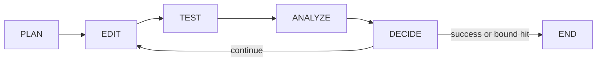

# loop_fixer

A goal-based agent loop that takes a failing test and iterates
**Act → Verify → Decide** — generating a patch, applying it, re-running the
test, and deciding whether to continue, stop-success, or stop-fail — until
the test passes or a bounded stop condition is hit. It's language-agnostic:
Python/pytest and Java/Maven are both supported today via a
`LanguageAdapter` abstraction (see "Language adapters" below), selected with
`--language`.

The one property the design optimizes for: **the agent cannot fake
success.** The test file (and, for Python, fixtures/pytest config) is
hard-excluded from the set of files a patch is allowed to touch — enforced
in code before a byte reaches disk — so the only way to make the loop
succeed is to actually fix the source. Every attempt is checkpointed on a
disposable git branch; any failure path ends in a hard rollback to baseline.

## Run it

Requires Python 3.13+.

```bash
python3.13 -m venv .venv && .venv/bin/pip install -e .
export ANTHROPIC_API_KEY=sk-...
.venv/bin/python -m loop_fixer --test path/to/test_file.py::test_name --repo /path/to/target/repo
```

The target repo must be a git repository with a clean working tree (the tool
refuses to start otherwise). It creates a dedicated `loop-fixer/...` branch,
prints one line per iteration as it happens, and leaves that branch checked
out with the result — it never touches your original branch.

### `--language {python,java}` (default: `python`)

```bash
export ANTHROPIC_API_KEY=sk-...
.venv/bin/python -m loop_fixer --language java \
  --test com.example.FooTest#testBar --repo /path/to/target/repo
```

The `--test` target syntax depends on the language: a pytest node-id
(`tests/test_foo.py::test_bar`) for `python`, or a Maven Surefire spec
(`com.example.FooTest#testBar` — exactly what `mvn -Dtest=...` already
expects, no invented syntax) for `java`. The Java path requires `mvn` on
`PATH`; if it's missing, the CLI fails fast with a clear error before
spending any LLM call.

## MCP server (for Claude Code and other MCP-capable harnesses)

Any harness that can shell out already works today via the CLI above. For
harnesses that speak [MCP](https://modelcontextprotocol.io), loop_fixer also
ships an MCP server exposing a single tool, `fix_test`, so the harness gets
structured tool discovery plus live PLAN/EDIT/TEST/ANALYZE/DECIDE progress as
`notifications/message` events, instead of just a final exit code.

```bash
.venv/bin/pip install -e ".[mcp]"
export ANTHROPIC_API_KEY=sk-...
claude mcp add loop-fixer-mcp -- loop-fixer-mcp
```

This is a transport/visibility upgrade over the CLI, **not** a change in LLM
sourcing: `fix_test` still uses loop_fixer's own `LangChainAnthropicClient` +
`ANTHROPIC_API_KEY`, exactly like the CLI. MCP's `sampling` mechanism — which
would let the connected harness's own model generate patches, avoiding a
second API key — is not used: Claude Code doesn't implement it as a client
([tracked upstream](https://github.com/anthropics/claude-code/issues/1785)),
and the MCP spec deprecated sampling as of its `2026-07-28` revision in favor
of a multi-round-trip mechanism that doesn't fit loop_fixer's synchronous
`run_loop()`. This may be revisited once client-side support exists.

Every bounded-authority guarantee below applies identically to this path —
it's the same `run_loop()`/`patch_apply.py`/adapters underneath, just with a
different `LLMClient` construction site and event sink (`loop_fixer/mcp_server.py`).

## Verify it manually (no API key needed)

`scripts/demo_run.py` runs the real production pipeline — the same
`fsm.py`/`git_checkpoint.py`/`patch_apply.py`/`test_runner.py` code the CLI
uses — with a scripted `FakeLLMClient` standing in for the network call, so
you can see the whole loop converge without `ANTHROPIC_API_KEY` set.

```bash
# 1. Seed a fresh scratch repo from the intentionally-broken fixture
rm -rf /tmp/demo
cp -r tests/fixtures/broken_repo /tmp/demo
cd /tmp/demo && git init -q && git config user.email demo@example.com \
  && git config user.name Demo && git add -A && git commit -q -m init
cd /Users/vimalkumarpatel/git/test

# 2. Run the demo loop against it
.venv/bin/python scripts/demo_run.py /tmp/demo
```

Expected output ends with `[result] status=success iterations=1 ...`, preceded
by one line per FSM state transition (PLAN/EDIT/TEST/ANALYZE/DECIDE).

Then inspect what it actually did:

```bash
cd /tmp/demo
cat calc.py                 # should show `return a + b` (fixed)
cat test_calc.py            # byte-identical to the original — never touched
git log --oneline           # "init" + "loop_fixer attempt 1: passed"
/Users/vimalkumarpatel/git/test/.venv/bin/python -m pytest test_calc.py -q   # 1 passed
cd /Users/vimalkumarpatel/git/test
```

To run the real CLI end-to-end against the same scratch repo with an actual
model instead of the fake client:

```bash
export ANTHROPIC_API_KEY=sk-...
.venv/bin/python -m loop_fixer --test test_calc.py::test_add --repo /tmp/demo
```

The same manual-verify pattern works for the Java/Maven path, via
`scripts/demo_run_java.py` and `tests/fixtures/broken_repo_java/` (requires
`mvn` on `PATH`):

```bash
rm -rf /tmp/demo_java
cp -r tests/fixtures/broken_repo_java /tmp/demo_java
cd /tmp/demo_java && git init -q && git config user.email demo@example.com \
  && git config user.name Demo && git add -A && git commit -q -m init
cd /Users/vimalkumarpatel/git/test

.venv/bin/python scripts/demo_run_java.py /tmp/demo_java
```

```bash
cd /tmp/demo_java
cat src/main/java/com/example/Calc.java   # should show `return a + b;` (fixed)
cat src/test/java/com/example/CalcTest.java   # byte-identical to the original — never touched
git log --oneline                          # "init" + "loop_fixer attempt 1: passed"
mvn -q -Dtest=com.example.CalcTest#testAdd -Dsurefire.failIfNoSpecifiedTests=false test  # BUILD SUCCESS
cd /Users/vimalkumarpatel/git/test
```

Run the automated test suite (unit tests + hermetic end-to-end demos, no
network calls — this is what CI/a reviewer would run). The Java e2e tests
drive a real `mvn test` subprocess and are skipped automatically if `mvn`
isn't on `PATH`, so the suite stays runnable without any Java tooling
installed:

```bash
.venv/bin/python -m pytest tests/ -v
```

## Language adapters

Everything language-specific — how to resolve a test target to a file path,
how to statically resolve which source files a patch may touch, how to
invoke the test runner, and how to extract a deterministic failure
signature from its output — lives behind one `LanguageAdapter` Protocol
(`loop_fixer/adapters/base.py`):

```python
class LanguageAdapter(Protocol):
    name: str
    def resolve_test_file(self, repo_root, target) -> Path: ...
    def resolve_writable_paths(self, repo_root, test_file) -> set[str]: ...
    def run_test(self, repo_root, target, timeout) -> TestResult: ...
    def compute_signature(self, result) -> str: ...
```

The chosen implementation is passed to `run_loop(..., adapter=...)` and
threaded through `config["configurable"]["adapter"]` inside the LangGraph
orchestration (see "Architecture" below); `plan`/`edit`/`test`/`analyze`
call through it instead of hardcoding pytest — `decide` (stop conditions,
git checkpointing) is untouched, because it was already language-neutral.
`TestResult` (`test_runner.py`) is the shared, language-neutral return type
both adapters produce.

- **`PythonPytestAdapter`** (`adapters/python_pytest.py`) — the original
  behavior, unchanged: parses pytest's `file::test` node-id, statically
  resolves the test file's same-repo imports via `ast` to build
  `writable_paths`, runs `python -m pytest <target>`, and extracts the
  trailing `"E "`-prefixed assertion line for the failure signature.
- **`JavaMavenAdapter`** (`adapters/java_maven.py`) — the new Java path:
  resolves `com.example.FooTest#testBar` to
  `src/test/java/com/example/FooTest.java`; resolves `writable_paths` as
  the union of (a) directory-convention mirroring (`FooTest`/`TestFoo` →
  `Foo`, checked against `src/main/java/...`) and (b) regex-parsing the
  test file's `import` statements for same-repo helper classes; runs
  `mvn -q -Dtest=<spec> -Dsurefire.failIfNoSpecifiedTests=false test`
  (raising `AdapterError` up front if `mvn` isn't on `PATH`); and extracts
  the last exception/assertion line from Surefire's output for the failure
  signature. In both cases the test file itself is never included in
  `writable_paths` — the same non-negotiable exclusion, enforced the same
  way, for both languages.
- `context.py`'s `truncate_output`/`normalize_failure_text` stay shared
  helpers both adapters call; only the "what's the last meaningful line"
  extraction is language-specific and lives inside each adapter module.

Adding a third language means writing one more adapter module and
registering it in `cli.py`'s `ADAPTERS` dict — no changes to `fsm.py`,
`patch_apply.py`, or `git_checkpoint.py` are needed.

## Architecture: four patterns considered, one chosen

Before writing code we compared four ways to structure the Act/Verify/Decide
loop:

| Pattern | Idea | Why not (or why) |
|---|---|---|
| Single-agent ReAct | One LLM call per turn does propose & judge in the same context. | Cheapest, but the same agent grades its own homework — no separation between proposing a fix and deciding it worked. |
| Actor–Critic | Separate Fixer and Verifier LLM roles; Verifier critiques the Fixer's diff. | Reduces self-serving bias, but 2× the LLM calls/cost per iteration, and still relies on an LLM's opinion somewhere. |
| **Deterministic FSM — chosen** | Code owns all control flow and stop conditions; LLM is called only as a tool for two narrow sub-tasks. | Verification becomes objective — success is the test runner's exit code, never an LLM's self-report. Easiest to harden with guardrails. |
| Search (best-of-N) | Generate N candidate patches per step, run each in isolation, keep the best. | Highest ceiling on hard bugs, but needs sandboxed parallel execution and N× cost — a v2 upgrade once the FSM backbone is proven. |

## How it runs: five graph nodes, one loop

Orchestration is a compiled [LangGraph](https://langchain-ai.github.io/langgraph/)
`StateGraph` (`loop_fixer/fsm.py`), not a hand-rolled `while` loop:



State is a `GraphState` `TypedDict` holding only checkpoint-safe primitives —
`repo_root`, `target_test`, `language`, the iteration bounds, `iteration`,
`attempts: list[dict]`, `status`, and so on. Each node has the signature
`node(state, config) -> dict` and returns a dict of updates that LangGraph
merges into state — nodes never mutate `state` in place. The non-serializable
runtime dependencies — the `LLMClient` instance, the `LanguageAdapter`
instance, and an optional `on_event` observability callback — are **not**
part of state; they're passed via `config["configurable"]` at invoke time
and read inside each node (e.g. `config["configurable"]["adapter"]`). This
keeps the graph's `InMemorySaver` checkpointer meaningful (nothing
unpicklable riding in state) and is what makes `compiled.invoke(state,
config=config)` — wrapped by the public `run_loop(initial_state, *,
llm_client, adapter, on_event=None, thread_id=None) -> dict` entrypoint —
drive the whole loop.

- **plan** resolves which files are writable (statically, via the active `LanguageAdapter`).
- **edit** calls the LLM for a patch and applies it via `patch_apply.py`.
- **test** is the *only* node that runs the test — through `adapter.run_test`.
- **analyze** computes a deterministic failure signature — through `adapter.compute_signature`.
- **decide** owns every stop-condition check and all git checkpointing; its conditional
  edge (`"continue"` → `edit`, `"terminate"` → `END`) is the graph's only branch.

Each node does exactly one job, and only `test` is allowed to run the test
runner and only `decide` is allowed to check stop conditions or touch git —
that separation is what makes the two guarantees below possible, identically
for every language adapter. An LLM/network failure in `edit` sets
`status="failed_error"` without recording an attempt; the downstream nodes
detect that and short-circuit as no-ops, so the loop still ends immediately
with no rollback and no iteration counted — matching the pre-migration
behavior exactly, just implemented as an explicit status check instead of
an early `while`-loop exit.

## The key guarantee: a verification signal the agent can't fake

The obvious failure mode for any "fix the test" agent is that it fixes the
*test*, not the bug — weakens the assertion, wraps it in `try/except`, or
deletes it. Two independent controls close that off, both enforced in code
rather than by prompting the model to behave:

1. **Protected-path allowlist.** Every patch is checked against a
   `writable_paths` set, computed by the active `LanguageAdapter` — for
   Python, the source files the failing test statically imports; for Java,
   the convention-mirrored main class plus imported same-repo helpers. The
   test file itself (and, for Python, `conftest.py`/pytest config) is never
   on that list. Any diff hunk touching a path outside it is rejected in
   `patch_apply.py` before a single byte is written to disk.
2. **Fresh subprocess, every time.** The TEST state always spawns a
   brand-new test-runner process (`pytest` or `mvn test`, via
   `adapter.run_test`) against the real files on disk and reads the OS exit
   code. There is no shared "did it pass" flag the LLM's output can ever
   touch — the agent's opinion of its own work is never consulted.

## Bounded authority

What the loop is allowed to read, write, and execute is an explicit
allowlist, not a convention:

| | Allowed | Enforced by |
|---|---|---|
| Read | Files under the repo root reachable from the target test's static analysis (import graph for Python, convention+imports for Java), plus the test file (read-only) | PLAN only opens statically-resolved files — no filesystem walk |
| Write | Only files on `writable_paths` — never the test file, conftest/pytest config, or `.git/` | `patch_apply.py` rejects out-of-allowlist and path-traversal hunks pre-write |
| Execute | Exactly one command shape per adapter — `python -m pytest <target>` or `mvn -q -Dtest=<spec> ... test` — built from code-controlled args | Each adapter's `run_test` is the only subprocess call site for its language; LLM output is never in a command line |
| Network | LLM API calls only | No other network-capable code exists in the package |

**Recoverability**: every attempt is git-committed on a disposable
`loop-fixer/<slug>/<timestamp>` branch; the user's original branch is never
checked out or modified. Any terminal failure runs `git reset --hard` back
to the pre-loop commit — the working tree ends up byte-identical to how it
started, never half-edited. Full attempt history stays inspectable via
`git log` on the disposable branch even after rollback.

## Stop conditions

| Condition | Default | Status | Exit code | On trigger |
|---|---|---|---|---|
| Test passes | — | `success` | `0` | Commit final state, branch left for review |
| Iteration cap | `--max-iters`, 5 | `failed_max_iter` | `2` | Print `Reached Maximum Allowed Loops` to stderr, roll back |
| No progress | `--no-progress-window`, 3 | `failed_no_progress` | `3` | Same normalized failure signature N times in a row → roll back |
| Wall-clock budget | `--max-seconds`, 300 | `failed_timeout` | `4` | Roll back to baseline |
| Unrecoverable error | — | `failed_error` | `5` | e.g. LLM/network failure — short-circuits immediately |

## Verified live

**Python/pytest** — four scenarios were run end-to-end against a seeded repo
(a one-line arithmetic bug: `calc.py` returning `a - b` instead of
`a + b`), plus the full automated suite:

1. **Converges to a passing test** — 1 iteration, fix committed, test file untouched.
2. **Rejects an attempt to edit the test file itself** — scripted the LLM to weaken the assertion (`assert True`) instead of fixing the bug; every attempt was rejected before touching disk, and the loop rolled back cleanly after exhausting the no-progress window.
3. **No-progress detector + clean rollback on an unfixable bug** — fed the loop a no-op diff repeatedly; it stopped after the failure signature repeated, and `git status`/`calc.py` matched baseline exactly.
4. **Exact exit contract on the iteration cap** — `--max-iters 2` against an unfixable bug exits `2` with `Reached Maximum Allowed Loops` on stderr.

**Java/Maven** — the same guarantees were verified live against
`tests/fixtures/broken_repo_java/`, with OpenJDK + Maven installed via
Homebrew for this session (`brew install openjdk maven`):

1. **Converges to a passing test** — ran the real CLI (`--language java`)
   against a scratch copy with a scripted `FakeLLMClient`: 1 iteration, `mvn
   -Dtest=com.example.CalcTest#testAdd test` went from `BUILD FAILURE` to
   `BUILD SUCCESS`, `Calc.java` shows `return a + b;`, `CalcTest.java` is
   byte-identical to the original, and an independent fresh `mvn test` run
   afterward confirms the pass.
2. **Rollback on an intentionally-unfixable bug** — a scripted no-op diff
   applied cleanly once, then was correctly rejected as stale on repeat
   attempts (patch context no longer matched); hit `--max-iters 3`, exited
   `2` with `Reached Maximum Allowed Loops`, and `git status`/`Calc.java`
   matched the pre-loop baseline exactly after rollback.
3. **Test-file-protection guard** (`tests/test_e2e_demo_java.py`) — an LLM
   diff targeting `CalcTest.java` directly is rejected in `patch_apply.py`
   before touching disk, same as the Python path.

One real bug was found and fixed during this live validation: the Maven
fixture initially had no `.gitignore`, so `mvn test`'s `target/` build
output made the working tree "dirty" and tripped `git_checkpoint.py`'s
clean-tree preflight check before the loop could even start. Fixed by
adding `tests/fixtures/broken_repo_java/.gitignore` (`target/`), matching
how a real Maven project's repo would already be configured.

**Full suite**: `34 passed` — the original 21 Python-path tests (unmodified
behavior) plus 10 new hermetic `JavaMavenAdapter` unit tests plus 3 new
live-`mvn` Java end-to-end tests, all run together with `mvn` on `PATH`.

### Orchestration migration to LangGraph

The orchestration layer (`loop_fixer/fsm.py`) was later rewritten around a
compiled LangGraph `StateGraph` — the hand-rolled `LoopState`/`Attempt`
dataclasses and `while`-loop dispatch table became a `GraphState` `TypedDict`
plus five graph nodes (see "How it runs" above). This was a pure
orchestration swap: `patch_apply.py`'s protected-path enforcement,
`git_checkpoint.py`'s checkpoint/rollback, and the adapters' fresh-subprocess
verification were not touched, and the same three guarantee-proving
scenarios were re-run against the rewritten graph for both languages —
converges to a passing test, rejects an LLM diff targeting the test file
(rolls back cleanly after the no-progress window), and hits `--max-iters`
with exit code `2` and `Reached Maximum Allowed Loops` on stderr — all
unchanged in outcome. Full suite: `34 passed`.

## Repo layout

```
loop_fixer/
├── fsm.py                    # GraphState + the five graph nodes + StateGraph wiring + run_loop()
├── patch_apply.py            # unified-diff parsing & application, all the safety guards
├── test_runner.py            # TestResult + subprocess wrapper around pytest
├── git_checkpoint.py         # preflight, branch/commit-per-attempt, rollback
├── llm_client.py             # LLMClient Protocol + LangChainAnthropicClient + FakeLLMClient
├── context.py                # output truncation + shared failure-text normalization
├── cli.py                    # argparse entrypoint; --language flag, adapter selection
├── adapters/
│   ├── base.py                # LanguageAdapter Protocol
│   ├── python_pytest.py       # PythonPytestAdapter (pytest node-ids, ast import resolution)
│   └── java_maven.py          # JavaMavenAdapter (Surefire specs, convention+import resolution)
├── mcp_server.py              # MCP tool front door (`fix_test`), optional `[mcp]` extra
└── prompts/                   # patch-generation / failure-summary prompt templates

tests/                          # unit + hermetic/live end-to-end tests
tests/fixtures/broken_repo/       # Python demo fixture
tests/fixtures/broken_repo_java/  # Java/Maven demo fixture
scripts/demo_run.py             # live Python demo using FakeLLMClient, no API key needed
scripts/demo_run_java.py        # live Java demo using FakeLLMClient, requires mvn on PATH
docs/plans/                     # planning docs from the design/build session
```
