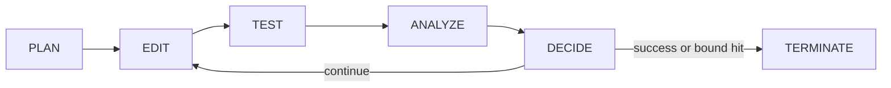

# loop_fixer

A goal-based agent loop that takes a failing pytest test and iterates
**Act → Verify → Decide** — generating a patch, applying it, re-running the
test, and deciding whether to continue, stop-success, or stop-fail — until
the test passes or a bounded stop condition is hit.

The one property the design optimizes for: **the agent cannot fake
success.** The test file, fixtures, and pytest config are hard-excluded
from the set of files a patch is allowed to touch — enforced in code before
a byte reaches disk — so the only way to make the loop succeed is to
actually fix the source. Every attempt is checkpointed on a disposable git
branch; any failure path ends in a hard rollback to baseline.

## Run it

```bash
python3 -m venv .venv && .venv/bin/pip install -e .
export ANTHROPIC_API_KEY=sk-...
.venv/bin/python -m loop_fixer --test path/to/test_file.py::test_name --repo /path/to/target/repo
```

The target repo must be a git repository with a clean working tree (the tool
refuses to start otherwise). It creates a dedicated `loop-fixer/...` branch,
prints one line per iteration as it happens, and leaves that branch checked
out with the result — it never touches your original branch.

## Verify it manually (no API key needed)

`scripts/demo_run.py` runs the real production pipeline — the same
`fsm.py`/`git_checkpoint.py`/`patch_apply.py`/`test_runner.py` code the CLI
uses — with a scripted `FakeLLMClient` standing in for the network call, so
you can see the whole loop converge without `ANTHROPIC_API_KEY` set.

```bash
# 1. Seed a fresh scratch repo from the intentionally-broken fixture
rm -rf /tmp/demo
cp -r tests/fixtures/broken_repo /tmp/demo
cd /tmp/demo && git init -q && git config user.email demo@example.com \
  && git config user.name Demo && git add -A && git commit -q -m init
cd /Users/vimalkumarpatel/git/test

# 2. Run the demo loop against it
.venv/bin/python scripts/demo_run.py /tmp/demo
```

Expected output ends with `[result] status=success iterations=1 ...`, preceded
by one line per FSM state transition (PLAN/EDIT/TEST/ANALYZE/DECIDE).

Then inspect what it actually did:

```bash
cd /tmp/demo
cat calc.py                 # should show `return a + b` (fixed)
cat test_calc.py            # byte-identical to the original — never touched
git log --oneline           # "init" + "loop_fixer attempt 1: passed"
/Users/vimalkumarpatel/git/test/.venv/bin/python -m pytest test_calc.py -q   # 1 passed
cd /Users/vimalkumarpatel/git/test
```

To run the real CLI end-to-end against the same scratch repo with an actual
model instead of the fake client:

```bash
export ANTHROPIC_API_KEY=sk-...
.venv/bin/python -m loop_fixer --test test_calc.py::test_add --repo /tmp/demo
```

Run the automated test suite (unit tests + hermetic end-to-end demo, no
network calls — this is what CI/a reviewer would run):

```bash
.venv/bin/python -m pytest tests/ -v
```

## Architecture: four patterns considered, one chosen

Before writing code we compared four ways to structure the Act/Verify/Decide
loop:

| Pattern | Idea | Why not (or why) |
|---|---|---|
| Single-agent ReAct | One LLM call per turn does propose & judge in the same context. | Cheapest, but the same agent grades its own homework — no separation between proposing a fix and deciding it worked. |
| Actor–Critic | Separate Fixer and Verifier LLM roles; Verifier critiques the Fixer's diff. | Reduces self-serving bias, but 2× the LLM calls/cost per iteration, and still relies on an LLM's opinion somewhere. |
| **Deterministic FSM — chosen** | Code owns all control flow and stop conditions; LLM is called only as a tool for two narrow sub-tasks. | Verification becomes objective — success is the test runner's exit code, never an LLM's self-report. Easiest to harden with guardrails. |
| Search (best-of-N) | Generate N candidate patches per step, run each in isolation, keep the best. | Highest ceiling on hard bugs, but needs sandboxed parallel execution and N× cost — a v2 upgrade once the FSM backbone is proven. |

## How it runs: five states, one loop



- **PLAN** resolves which files are writable (statically, from the failing test's imports).
- **EDIT** calls the LLM for a patch and applies it via `patch_apply.py`.
- **TEST** is the *only* state that runs pytest.
- **ANALYZE** computes a deterministic failure signature.
- **DECIDE** owns every stop-condition check and all git checkpointing.

Each state does exactly one job, and only `TEST` is allowed to run pytest
and only `DECIDE` is allowed to check stop conditions or touch git — that
separation is what makes the two guarantees below possible.

## The key guarantee: a verification signal the agent can't fake

The obvious failure mode for any "fix the test" agent is that it fixes the
*test*, not the bug — weakens the assertion, wraps it in `try/except`, or
deletes it. Two independent controls close that off, both enforced in code
rather than by prompting the model to behave:

1. **Protected-path allowlist.** Every patch is checked against a
   `writable_paths` set — by default, only the source files the failing
   test statically imports. The test file itself, `conftest.py`, and pytest
   config are never on that list. Any diff hunk touching a path outside it
   is rejected in `patch_apply.py` before a single byte is written to disk.
2. **Fresh subprocess, every time.** The TEST state always spawns a
   brand-new `pytest` process against the real files on disk and reads the
   OS exit code. There is no shared "did it pass" flag the LLM's output can
   ever touch — the agent's opinion of its own work is never consulted.

## Bounded authority

What the loop is allowed to read, write, and execute is an explicit
allowlist, not a convention:

| | Allowed | Enforced by |
|---|---|---|
| Read | Files under the repo root reachable from the target test's import graph, plus the test file (read-only) | PLAN only opens statically-resolved files — no filesystem walk |
| Write | Only files on `writable_paths` — never the test file, conftest, pytest config, or `.git/` | `patch_apply.py` rejects out-of-allowlist and path-traversal hunks pre-write |
| Execute | Exactly one command shape: `python -m pytest <target>`, built from code-controlled args | `test_runner.py` is the only subprocess call site; LLM output is never in a command line |
| Network | LLM API calls only | No other network-capable code exists in the package |

**Recoverability**: every attempt is git-committed on a disposable
`loop-fixer/<slug>/<timestamp>` branch; the user's original branch is never
checked out or modified. Any terminal failure runs `git reset --hard` back
to the pre-loop commit — the working tree ends up byte-identical to how it
started, never half-edited. Full attempt history stays inspectable via
`git log` on the disposable branch even after rollback.

## Stop conditions

| Condition | Default | Status | Exit code | On trigger |
|---|---|---|---|---|
| Test passes | — | `success` | `0` | Commit final state, branch left for review |
| Iteration cap | `--max-iters`, 5 | `failed_max_iter` | `2` | Print `Reached Maximum Allowed Loops` to stderr, roll back |
| No progress | `--no-progress-window`, 3 | `failed_no_progress` | `3` | Same normalized failure signature N times in a row → roll back |
| Wall-clock budget | `--max-seconds`, 300 | `failed_timeout` | `4` | Roll back to baseline |
| Unrecoverable error | — | `failed_error` | `5` | e.g. LLM/network failure — short-circuits immediately |

## Verified live

Four scenarios were run end-to-end against a seeded repo (a one-line
arithmetic bug: `calc.py` returning `a - b` instead of `a + b`), plus the
full automated suite:

1. **Converges to a passing test** — 1 iteration, fix committed, test file untouched.
2. **Rejects an attempt to edit the test file itself** — scripted the LLM to weaken the assertion (`assert True`) instead of fixing the bug; every attempt was rejected before touching disk, and the loop rolled back cleanly after exhausting the no-progress window.
3. **No-progress detector + clean rollback on an unfixable bug** — fed the loop a no-op diff repeatedly; it stopped after the failure signature repeated, and `git status`/`calc.py` matched baseline exactly.
4. **Exact exit contract on the iteration cap** — `--max-iters 2` against an unfixable bug exits `2` with `Reached Maximum Allowed Loops` on stderr.
5. **Full suite**: `21 passed` (unit tests for fsm/patch_apply/git_checkpoint/cli, plus a hermetic end-to-end demo — no network calls).

## Repo layout

```
loop_fixer/
├── fsm.py             # LoopState/Attempt + the five FSM states + run_loop()
├── patch_apply.py     # unified-diff parsing & application, all the safety guards
├── test_runner.py     # subprocess wrapper around pytest (the verification signal)
├── git_checkpoint.py  # preflight, branch/commit-per-attempt, rollback
├── llm_client.py       # LLMClient Protocol + AnthropicLLMClient + FakeLLMClient
├── context.py          # output truncation + failure-signature normalization
├── cli.py               # argparse entrypoint
└── prompts/              # patch-generation / failure-summary prompt templates

tests/                    # unit + hermetic end-to-end tests
scripts/demo_run.py        # live demo using FakeLLMClient, no API key needed
docs/plans/                 # planning docs from the design/build session
```
